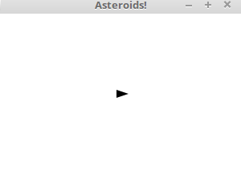
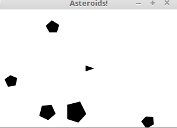
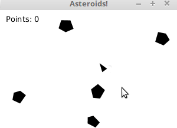

# Java-Asteroids
A simple Asteroids Javafx application created using Java.
Below are some rules for playing the game:
<ul>
<li>Use <b><i>left/ right arrow keys</i></b> to control the rotation of the key</li>
<li>Use <b><i>top/ bottom arrow keys</i></b> to control the speed of the key</li>
</ul>

<ul>
<li>Use <b><i>space bar</i></b> to "fire"</li>
</ul>

<i>p/s: each space bar pressing will shoot 3 bullets & the ship will be unable to shoot while there are 3 bullets on the window </i>

<ul>
<li>Try to score as high as you could before colliding with the asteroids</li>
</ul>

<ul>
<li>Feel free to download the JAR file from: https://drive.google.com/file/d/1aR4EaqbtxjmY3J6ehOnl1JSjzWflGrxl/view?usp=sharing</li>
</ul>
<i>p/s: after the JAR file is extracted, double click on the "loader.bat" will run the game. Enjoy!</i>
